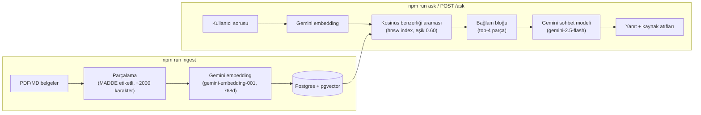

# muhzek-rag

[](https://github.com/mehmetuyanikrs-cpu/muhzek-rag/actions/workflows/ci.yml)
[](LICENSE)
[](package.json)
[](docker-compose.yml)

**Türkçe mühendislik yönetmelikleri üzerinde çalışan uçtan uca RAG (Retrieval-
Augmented Generation) referans uygulaması.** PDF yönetmelik → parçalama →
embedding → pgvector → benzerlik araması → LLM yanıtı, kaynak atıflı. Docker
Compose ile tek komutla ayağa kalkar. [MuhzekAI](https://muhzekai.com)'nin
mühendislik asistanındaki RAG bilgi tabanı mimarisinin (pgvector + Gemini
embedding) **bağımsız, kamuya açık bir referans uygulaması** — üretim kodunun
birebir kopyası değil (bkz. [Kapsam ve sınırlar](#kapsam-ve-sınırlar)).

> **EN:** An end-to-end RAG reference app over Turkish engineering
> regulations: PDF → chunking → Gemini embeddings → pgvector → cosine
> similarity search → cited LLM answer. One-command Docker Compose setup.
> An independent, open-source reference implementation of the RAG
> architecture (pgvector + Gemini embeddings) running in production at
> [muhzekai.com](https://muhzekai.com)'s engineering assistant — not a copy
> of the production code (see [Scope & limits](#kapsam-ve-sınırlar)).

## Bilgi tabanı

Yalnızca kamuya açık, resmî yönetmelik metinleri — kurumsal/müşteri belgesi
yok:

| Kategori | Belge | Kaynak |
|---|---|---|
| İmar | Planlı Alanlar İmar Yönetmeliği | Resmî Gazete |
| Karayolları | Karayolları Trafik Yönetmeliği | [mevzuat.gov.tr](https://mevzuat.gov.tr) |
| HKMO | TMMOB Harita ve Kadastro Mühendisleri Odası Serbest Mühendislik Müşavirlik Büroları Tescil Yönetmeliği | [mevzuat.gov.tr](https://mevzuat.gov.tr) |

> Not: KGM'nin "Karayolları Teknik Şartnamesi" kitapçığı yazılı izin
> olmadan çoğaltılamaz ibaresi taşıdığı için buraya **dahil edilmedi**;
> onun yerine aynı alanda, resmî olarak yayımlanmış ve serbestçe
> dağıtılabilen Karayolları Trafik Yönetmeliği kullanıldı. Bu bir demo/
> referans uygulamasıdır — gerçek bir işlemde kullanmadan önce ilgili
> yönetmeliğin güncel halini [mevzuat.gov.tr](https://mevzuat.gov.tr)'den
> doğrulayın.

## Mimari



## Kurulum

```bash
git clone https://github.com/mehmetuyanikrs-cpu/muhzek-rag.git
cd muhzek-rag
cp .env.example .env
# .env içine kendi GEMINI_API_KEY'ini yaz
# (ücretsiz: https://aistudio.google.com/apikey)

# 1) Veritabanını başlat
docker compose up -d db

# 2) Bağımlılıkları kur, belgeleri yükle
npm install
npm run ingest

# 3a) CLI'dan sor
npm run ask -- "Kat yüksekliği İmar Yönetmeliği'nde nasıl tanımlanır?"

# 3b) veya API sunucusunu başlat
npm run dev
curl -X POST localhost:3000/ask -H "Content-Type: application/json" \
  -d '{"question":"Hususi otomobil sürücüleri için alkollü araç kullanma sınırı kaç promildir?"}'
```

Tüm yığını (db + app) tek komutla ayağa kaldırmak için: `docker compose up`
(ardından belgeleri yüklemek için `docker compose run app npm run ingest`).

## Örnek sorgular

Gerçek `npm run ingest` + `npm run ask` çıktısı (kısaltılmadı):

```
$ npm run ask -- "Kat yüksekliği İmar Yönetmeliği'nde nasıl tanımlanır?"

Kat yüksekliği, binanın herhangi bir katının döşeme üstünden bir üstteki
katının döşeme üstüne kadar olan mesafesidir.
[imar/planli-alanlar-imar-yonetmeligi — Bölüm 4]

--- Kullanılan parçalar (retrieval) ---
  [0.77] imar/planli-alanlar-imar-yonetmeligi — MADDE 9
  [0.77] imar/planli-alanlar-imar-yonetmeligi — Bölüm 32
  [0.75] imar/planli-alanlar-imar-yonetmeligi — Bölüm 4
  [0.74] imar/planli-alanlar-imar-yonetmeligi — MADDE 28
```

```
$ npm run ask -- "Hususi otomobil sürücüleri için alkollü araç kullanma yasal sınırı kaç promildir?"

Hususi otomobil sürücülerinin kanlarındaki alkol miktarı 0.50 promilin
üzerinde olması durumunda karayolunda araç sürmeleri yasaktır.
[karayollari/karayollari-trafik-yonetmeligi — MADDE 97]

--- Kullanılan parçalar (retrieval) ---
  [0.76] karayollari/karayollari-trafik-yonetmeligi — MADDE 97
  [0.64] karayollari/karayollari-trafik-yonetmeligi — Bölüm 37
  [0.61] karayollari/karayollari-trafik-yonetmeligi — MADDE 98
  [0.60] karayollari/karayollari-trafik-yonetmeligi — MADDE 92
```

```
$ npm run ask -- "HKMO Serbest Mühendislik Müşavirlik Büroları Tescil Yönetmeliği'nin amacı nedir?"

HKMO Serbest Mühendislik Müşavirlik Büroları Tescil Yönetmeliği'nin amacı şunlardır:
  • Serbest çalışan Harita ve Kadastro Mühendislik Müşavirlik Hizmeti üreten
    kişi ve kuruluşların mesleki etkinliklerinin HKMO tarafından denetlenmesini
    sağlamak.
  • Harita ve Kadastro Mühendislik Müşavirlik Hizmetlerinin mesleki, bilimsel
    ve teknik esaslarının ülke ve meslektaş yararları yönünden gelişmesini
    sağlamak.
  • Meslektaşlar arasında haksız rekabetin önlenmesine ilişkin esasları
    düzenlemek.
[hkmo/hkmo-serbest-musavirlik-muhendislik-burolari-tescil-yonetmeligi — MADDE 1]

--- Kullanılan parçalar (retrieval) ---
  [0.77] hkmo/... — MADDE 1
  [0.75] hkmo/... — MADDE 13
  [0.67] hkmo/... — MADDE 15
  [0.65] hkmo/... — MADDE 10
```

Bağlamda yeterli bilgi yoksa model uydurmaz — `docker compose up` ile
çalışan REST API üzerinden aynı davranış:

```
$ curl -s -X POST localhost:3000/ask -H "Content-Type: application/json" \
    -d '{"question":"Bodrum katta otopark yapılabilir mi?"}'

{"answer":"Bu bilgi bilgi tabanında bulunamadı.","sources":[...0.65, 0.64, 0.64, 0.62...]}
```

## Mimari kararlar

Kararların gerekçeleri kodda da (`src/config.ts`) yorum olarak duruyor;
burada özetlendi:

- **Parça boyutu (2000 karakter, tavan 8000):** Bir "MADDE" fıkrasının
  bağlamını koparmadan tek parçaya sığdıracak kadar büyük, embedding'in
  konuyu bulanıklaştırmayacağı kadar küçük bir hedef. Tavan, tablo/liste gibi
  bölünmemiş blokların hedefi aşmasına izin verir — yalnız tavanı aşan
  parçalar zorla (paragraf/satır sınırında) bölünür.
- **"MADDE n" bölüm etiketleme:** Türk yönetmelik/tüzük metinleri madde
  numaralı yapıdadır; her parçanın ilk MADDE referansı bölüm etiketi olarak
  yakalanır, kullanıcıya "[kaynak — MADDE 12]" gibi somut bir atıf sunar.
- **Embedding modeli — `gemini-embedding-001`, 768 boyut:** Google'ın
  ücretsiz kotada sunduğu, Türkçe dahil çok dilli metinlerde iyi performans
  gösteren güncel modeli. 768 boyut, pgvector hnsw indeksinde 1536/3072'ye
  göre daha ucuz depolama/arama sağlıyor; bu ölçekte (birkaç yönetmelik)
  doğruluk kaybı gözlenmedi.
- **Embedding'e yalnız ilk 1000 karakterin gönderilmesi:** Tam parçanın DB'ye
  yazılan hâli daha uzun olabilir (2000-8000); vektörleme yalnızca konuyu
  yakalamaya yetecek bir ön ekten yapılıyor — gereksiz token maliyetinden
  kaçınmak için.
- **Benzerlik eşiği (0.60):** Kosinüs benzerliği bu değerin altındaki
  parçalar bağlama hiç girmiyor. Değer, `eval/` betiğiyle bu korpus üzerinde
  doğrulandı (bkz. aşağıdaki tablo) — alakasız en yakın komşuları eliyor,
  gerçek isabetleri (tipik 0.70+) kesmiyor.
- **Tek sağlayıcı (Gemini), embedding + sohbet için de aynı sağlayıcı:**
  Üretimdeki (muhzekai.com) sistem kota/maliyet optimizasyonu için 8+
  sağlayıcı arasında otomatik geçiş yapan bir yönlendirici kullanıyor; bu
  referans uygulama okunabilirlik için kasıtlı olarak sadeleştirildi (bkz.
  [Kapsam ve sınırlar](#kapsam-ve-sınırlar)).

## Retrieval kalitesi nasıl ölçüldü

`eval/sorular.json` — 3 belgeden dengeli dağılmış ~12 soru (+ 1 alakasız
kontrol sorusu, yanlış pozitif kontrolü için) — `eval/calistir.ts` ile
çalıştırılır:

```bash
npm run eval
```

Her soru için top-1 ve top-3 sonuçların beklenen kaynak kategorisiyle
eşleşip eşleşmediği ve ortalama benzerlik skoru raporlanır. Gerçek sonuç
(212 parça / 3 belge üzerinde, `gemini-embedding-001`, eşik 0.60):

| Ölçüt | Sonuç |
|---|---|
| Top-1 isabet | **11/11** |
| Top-3 isabet | **11/11** |
| Kontrol sorusu (alakasız → boş sonuç) | **1/1** |
| Doğru isabetlerde ortalama top-1 benzerlik | **0.739** |

Tüm sorularda doğru kaynak ilk sırada döndü; alakasız kontrol sorusu
(`"Bugün hava nasıl, en sevdiğin renk ne?"`) hiçbir parça döndürmedi —
eşiğin yanlış pozitifleri elediğinin kanıtı. Küçük, konu bazında ayrık bir
korpusta (3 farklı yönetmelik) bu skorlar beklenen bir üst sınır; gerçek bir
üretim korpusunda (yüzlerce/binlerce parça, örtüşen konular) isabet oranının
düşmesi normaldir — bkz. üretimdeki 82→2606 parça geçişinde eşiğin 0.55'ten
0.60'a çekilmesi.

## Kapsam ve sınırlar

Bu, muhzekai.com'daki üretim RAG asistanının **basitleştirilmiş, bağımsız**
bir referans uygulamasıdır. Üretimde ek olarak şunlar var — burada kasıtlı
olarak **yok**:

- 8+ sağlayıcı arasında otomatik geçiş yapan yönlendirici (kota/maliyet
  optimizasyonu, iş mantığı).
- Kullanıcı hesapları, günlük kota sistemi, kullanım takibi.
- Supabase'e özgü RLS/güvenlik katmanı (burada düz Postgres + Docker
  kullanılıyor, kimlik doğrulama içermiyor — yerel/demo amaçlıdır, olduğu
  gibi internete açılmamalı).
- ~2600 parçalık geniş, çok disiplinli bir bilgi tabanı (burada yalnızca 3
  kamuya açık belge var).

## Test

```bash
npm install
npm test        # chunker birim testleri (DB/API gerektirmez)
npm run build    # tip kontrolü
npm run eval      # retrieval kalite ölçümü (DB + GEMINI_API_KEY gerekir)
```

## Lisans

MIT — mimarisi [muhzekai.com](https://muhzekai.com)'da üretimde çalışıyor.
